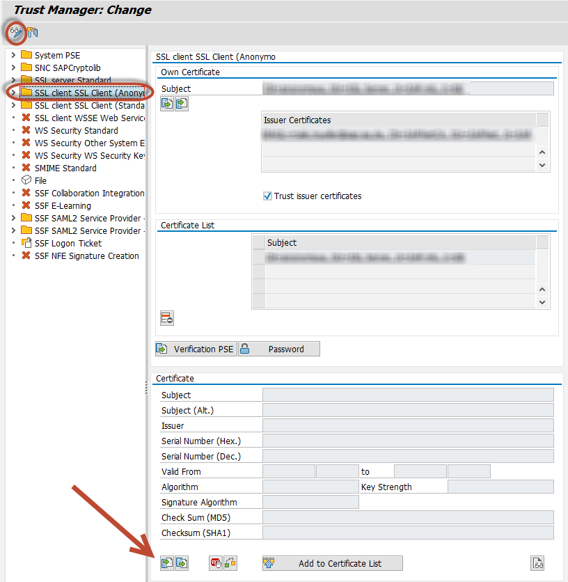
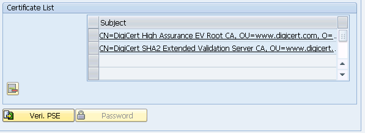

##### Option A - Chrome #####
1. On chrome, go to [https://github.com](https://github.com)
2. Click on the locker near the address bar, then click on "Details"
3. The developer tools will open at the Security tab. Click on "View certificate"
4. Go to the "Details" tab and click on "Copy to file..." to export to a .CER file
5. Open the "Certification path" tab and navigate to the parent node at the tree, do this until the root

##### Option B - Firefox #####
1. Use Firefox to go to [https://github.com](https://github.com)
2. Click on the lock icon and then "More Information ..." and there "View Certificate"
3. Switch to the Details Tab and choose the first certificate of the tree and click Export
4. Do the same for the next certificate in the tree

##### Option C - Manual #####
1. Goto github, find the certificate that it is using
2. Download certificate from [https://www.digicert.com/digicert-root-certificates.htm](https://www.digicert.com/digicert-root-certificates.htm)

##### Then continue here #####
1. Install the certificates in STRUST transaction:
* Click on the Change button
* Open "SSL client Client SSL Client (Anonymous)" folder
* In the third box, Certificate, click on the bottom-left button "Import certificate" and "Add to certificate list".
* Upload all the downloaded certificates
* Save



Report [ZABAPGIT_TEST_SSL](./other-test-ssl.html) can be used to verify that the connection works.

Also see blogs
* http://scn.sap.com/people/jens.gleichmann/blog/2008/10/31/calling-webservices-from-abap-via-httpsssl-with-pfx-certificates
* http://scn.sap.com/people/thomas.jung/blog/2004/11/17/bsp-a-developers-journal-part-xiv--consuming-webservices-with-abap

The certificate list should end up looking something like this:


### GitHub
On [Feburary 22nd](https://githubengineering.com/crypto-removal-notice/), GitHub deprectated weak TSL connections.

See [SAP note 510007](https://launchpad.support.sap.com/#/notes/510007), section 7, for information on how to configure SSL.

Add profile parameters:
```
ssl/client_ciphersuites = 150:PFS:HIGH::EC_P256:EC_HIGH
ssl/ciphersuites = 135:PFS:HIGH::EC_P256:EC_HIGH
```
